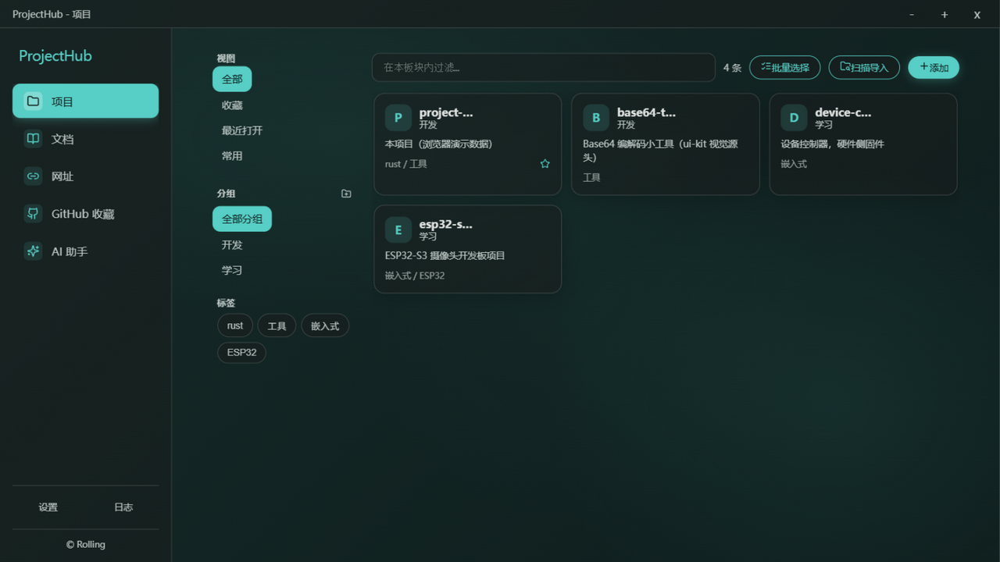
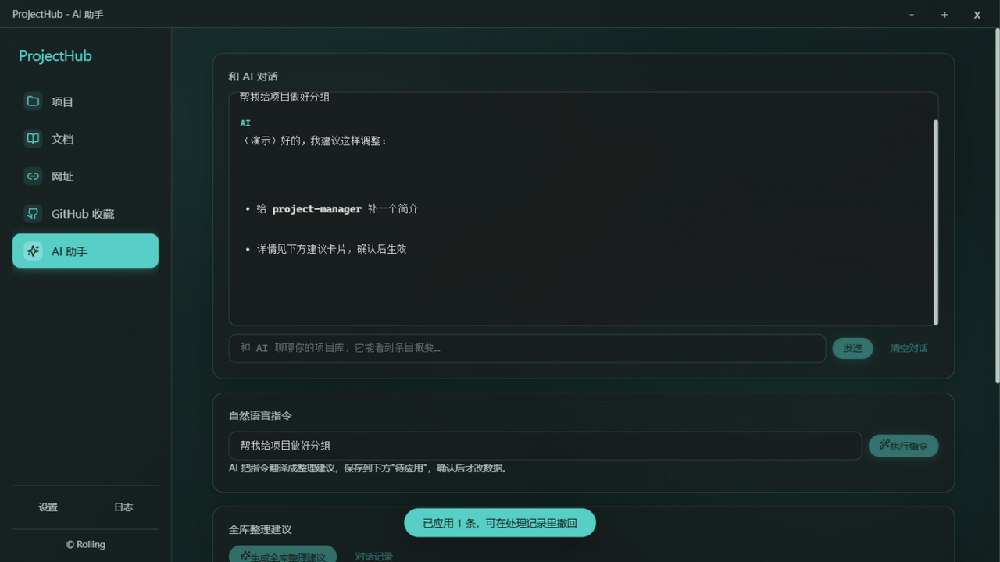

# ProjectHub

个人项目管理工具：**四个独立板块**（本地代码项目 / 资料文档目录 / 网址收藏 / GitHub 收藏）集中管理你的项目与资料，每条可备注、分组、打标签、收藏置顶。





## 功能特性

- **四板块独立管理**：每块有自己的收藏夹、自定义分组、最近打开/常用视图
- **一键打开**：资源管理器 / 终端（Windows Terminal 优先）/ 默认编辑器 / 浏览器
- **README 阅读**：本地项目选中即渲染；GitHub 收藏粘贴仓库地址自动抓取 README 与图片到本地（不走 GitHub API、无需 token），离线可看
- **AI 助手**（可选，任意 OpenAI 兼容服务）：条目信息补全、全库整理建议（含自动创建分组）、自然语言整理、纯对话，所有修改经确认后应用、可逐条撤回
- **批量操作**：批量选择/删除、目录扫描批量导入 Git 仓库
- **跨板块搜索**：Ctrl+K 全局命令面板
- **数据全本地**：SQLite 存储，JSON 导入/导出备份
- **玻璃拟态 UI**：无边框亚克力透明窗口、主题色自定义（调色盘/16 进制）、亮暗模式三选一（跟随系统/亮/暗，锁定后原生控件装饰一并切换）
- **图标选择器**：内置 156 个图标可筛选挑选，不用记图标名；卡片与详情都用它（未设图标时显示名称首字母）

## 技术栈

Tauri 2（Rust）+ 原生 ES 模块 + Vite，SQLite（rusqlite），marked + DOMPurify + highlight.js。

## 开发

依赖：Node ≥ 18、Rust（可编译 Tauri v2），以及同级目录的 **ui-kit**（见下方说明）。

```bash
npm install
npm run dev     # Tauri 桌面端
npm run ui      # 仅前端（浏览器模式，数据为演示桩）
```

改动之后的自查（这几条能覆盖最容易回归的点）：

| 命令 / 操作 | 看什么 |
|---|---|
| `npm run build` | 构建通过；`dist/assets` 里**不应**再出现数百 KB 的 `icons-*.js`（图标已改为白名单静态 import） |
| `cargo check --manifest-path src-tauri/Cargo.toml` | 原生侧编译通过，且无警告 |
| 打开任一条目 | 详情"最近打开"应与系统时间一致；同一个应用里日志面板也是本地时间 |
| 系统设深色 + 应用内锁亮色 | 表面与**下拉展开面板的滚动条/边框**应同为亮色 |
| 给条目选一个图标 | 卡片立刻显示该图标；填了不在列表里的名字会被表单拦住 |
| 来回切换四个板块 | 不应闪出"只有 视图/分组/标签 三个表头、卡片还是空的"那一帧 |

## 数据与备份

全部数据在本地 SQLite（`app_data_dir/project-manager.db`），可导出为 JSON 备份。

导出时 AI 的 API Key 会被脱敏成占位符，导入时遇到占位符会跳过 —— 备份文件可以放心拷走或传阅，
换机后重新填一次 Key 即可。导入会同时清空 AI 建议与对话记录：那些记录带着导出时那套条目 id，
导入后 id 会落到别的条目上，留着会让"应用建议"改错东西。

## 关于 ui-kit 依赖

本仓库的毛玻璃 UI 来自作者的开源套件 **[@rolling/ui-kit](https://github.com/Rolling-39/ui-kit)**（主题变量 + 窗口骨架 + 组件 + 原生亚克力背景管理）：

- `package.json` 中 `"@rolling/ui-kit": "file:../ui-kit"`
- `src-tauri/Cargo.toml` 中 `tauri-ui-kit = { path = "../../ui-kit/rust" }`

克隆时把两个仓库放在同一级目录即可：

```bash
git clone https://github.com/Rolling-39/ui-kit ../ui-kit
```

有一处契约要遵守：套件在切换面板时会**等 `mount()` 的 promise 落地才揭示新面板**
（在那之前上一个面板一直留在屏幕上），所以 `mount()` 的 promise 必须等于"首屏已渲染"。
本仓库的 `shared/section.js` 因此是 `export async function mountSection(...)`，
并在结尾 `await load()` —— 这个 `await` 不能去掉，去掉就会在切换时闪出"只有表头、
没有卡片"的空骨架。详见套件仓库的 `docs/USAGE.md` 第 3 节。

## License

MIT © Rolling
